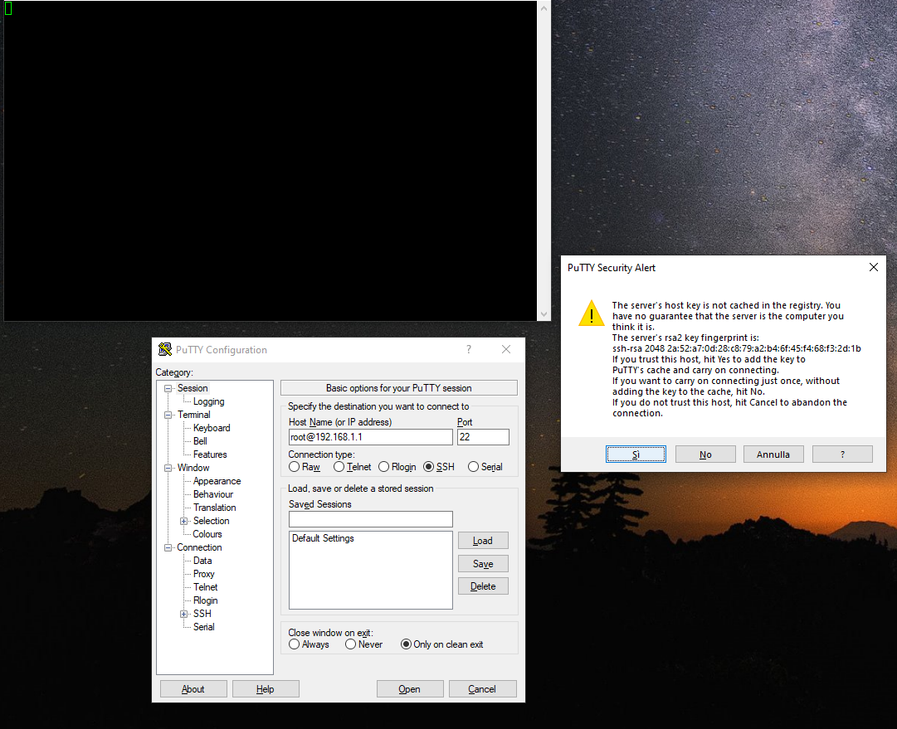
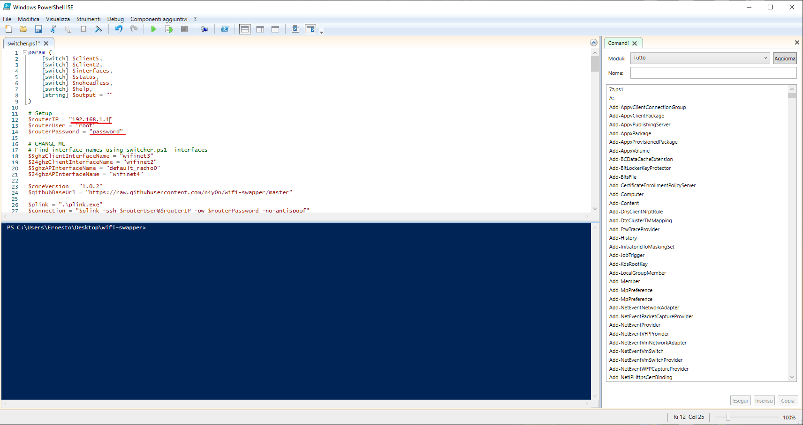

# wifi-swapper
Powershell OpenWrt Wifi AP Swapper for Tp-Link Archer C6 v2

1 - Apri putty.exe e collegati tramite ssh al router.

2 - Modifica il file `switcher.ps1` aggiungendo l'ip del router e la password per accedervi. 

3 - Trova le interfacce giuste nel router con `get-interfaces.bat`.

4 - Modifica il file `switcher.ps1` aggiungendo i nomi delle interfacce.

5 - Avvia install.bat per salvare lo script in AppData/WifiSwapper e aggiungere un collegamento al menu start e al desktop.
